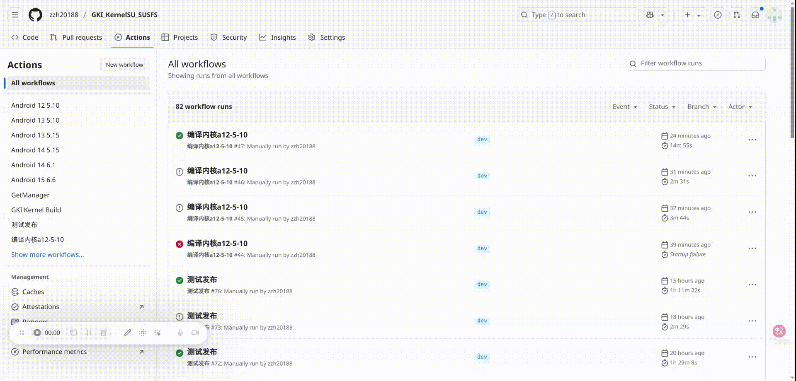

### 这是一个自动构建GKI内核的仓库

> 非GKI可以尝试[SukiSU云盘](https://alist.shirkneko.top)的资源，不支持一加ColorOS14、15
>
> 第一次使用务必**详细阅读**以下内容，不要因为懒惰而占用他人时间！
>
> 最近更新：1.一加8ELITE处理器可使用6.6内核(未测试)、2.修复这些GKI版本编译报错——[5.10.(66、81、101)、5.15.(74、94、104)]
### 下载
可以[在此](https://github.com/zzh20188/GKI_KernelSU_SUSFS/releases)下载您的资源
1. 关于Anykernel3.zip，下载即用！
- 然后使用刷入软件，例如[HorizonKernelFlasher](https://github.com/libxzr/HorizonKernelFlasher/releases)进行刷写内核
2. 关于boot.img，下载与你内核格式相匹配的（无压缩、gz、lz4），[参考](https://kernelsu.org/zh_CN/guide/installation.html#install-by-kernelsu-boot-image) **找到合适的 boot.img** 一节
- 使用[FASTBOOT](https://magiskcn.com/)刷入，或者使用刷写软件刷写到ROOT所在插槽的boot分区(例如爱玩机、Kernelflasher)

### 支持
| 功能 | 说明 |
| --- | --- |
| [KernelSU](https://kernelsu.org/zh_CN/) | 包括**原版、MKSU、SUKISU、NEXT** |
| [SUSFS4](https://gitlab.com/simonpunk/susfs4ksu) | 在内核层面辅助KSU隐藏的功能补丁 |
| [BBR](https://blog.thinkin.top/archives/ke-pu-bbrdao-di-shi-shi-me) | TCP拥塞控制算法，使网络更快？ |
| [Wireguard](https://zh.wikipedia.org/wiki/WireGuard) | 参考左侧wiki链接 |
| [LZ4KD](https://github.com/ShirkNeko/SukiSU_patch/tree/main/other) | 听说是来自HUAWEI source的ZRAM算法，补丁由[云彩之枫](http://www.coolapk.com/u/24963680)移植 |

<details>

<summary>还支持这几种算法，可在scene的ZRAM切换</summary>

### LZ4K、LZ4HC、deflate、842、~~zstdn~~、lz4k_oplus

</details>

### KSU管理器
在编译完成后，你会看到类似 `Next-Manager(12600)`的文件，简单来说这就是与内核一同上传的***最新管理器***。

同样的，在[Release](https://github.com/zzh20188/GKI_KernelSU_SUSFS/releases)也同样包含***最新管理器***！


### 紧急救援指南

> [!IMPORTANT]
> **触发条件**  
> 当设备因以下原因无法启动时需执行救援：  
> - 刷入错误/不兼容的内核
> - 内核版本适配异常（如5.10.66刷233版本的内核）
1. 进入FASTBOOT模式

- 物理键组合：电源+音量- 或者 ADB命令： `adb reboot bootloader`

2. 执行刷写命令
```bash
$ fastboot flash boot <boot.img文件全称>
```
### 原版镜像获取途径
1. 从现有固件提取

- 卡刷包：解压后使用[payload-dumper工具](https://magiskcn.com/payload-dumper-go-boot.html)

- 线刷包：直接解压获取boot.img

2.外部资源获取

- 社区平台搜索：机型+原厂boot (如XDA/酷安)

- [移动端在线提取远程获取](https://magiskcn.com/payload-dumper-compose.html)

> [!TIP]
> ### 内核版本兼容性说明
> 
> **1. 跨子版本刷机规则**  
> 当手机GKI主版本为5.10.x时（如5.10.168），可刷写同主版本更高子版本的内核（如5.10.198）。  
> 关于**X-lts**版本，以 `android12-5.10.X-lts-AnyKernel3.zip` 为例：
> - **X-lts** 表示长期支持版（子版本号最大，当前示例为5.10.236）
> - LTS随着GKI源码更新，编译版本号将持续递增（其他如198的版本，是永久固定的）
> - ⚠️ 注意：LTS虽为最新，**但**最新版≠最稳定（如6.6.x存在自动重启BUG）
> 
> **2. 内核版本伪装方法**  
> 在MT管理器终端执行：
> ```bash
> uname -r | sed 's/^[^-]*//'
> ```
> 获取后直接复制，将此版本号填入Action编译面板即可实现内核版本伪装。
> 
> **3. 编译优化建议**  
> 修改 [配置文件](.github/workflows/kernel-a12-5.10.yml)（如kernel-a12-5.10.yml）：
> - ▶️ 删除/注释不需要的GKI版本配置（**加速编译**）
> - ➕ 添加指定GKI版本（参考[定制指南](https://www.coolapk.com/feed/62820671?shareKey=OGMxYmZmNTk0YzIxNjgxNzM1MzI~&shareUid=11253396&shareFrom=com.coolapk.market_15.2.2)）
> - 📅 内核构建时间，参照[gki-kernel.yml](.github/workflows/gki-kernel.yml) 文件 **`第490行左右的注释`** 进行修改

### 更多内容
可以提及您的意见...我会尝试！
